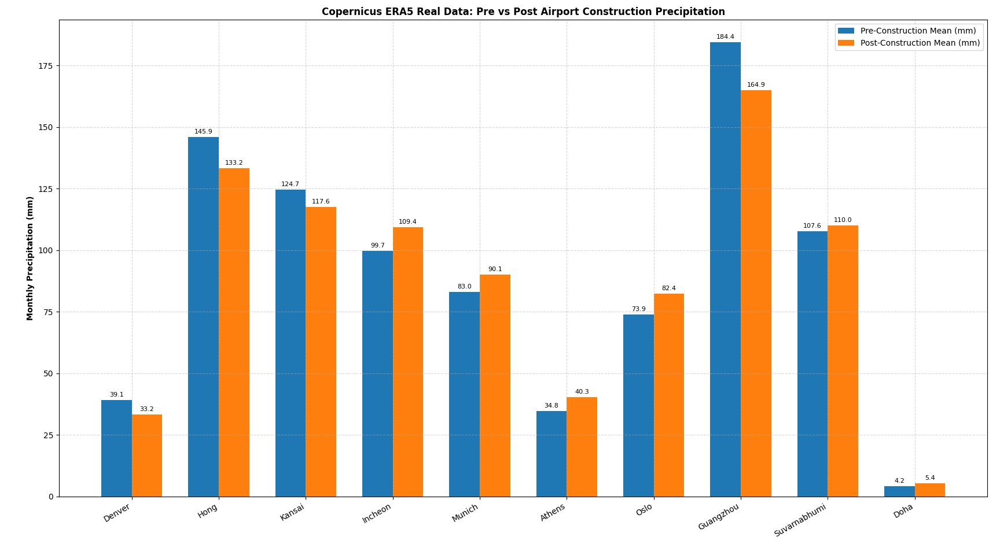

# Do airports influence the amount it rains?

Rain clouds often rely on orographic lift—when air is forced upward by hills or mountains, causing it to cool, condense, and dump rain while neighboring elevated areas frequently get more rain

The findings show that large asphalt surfaces and aircraft traffic introduce small forces that slightly promote rising air currents and ice nucleation—the exact opposite of a rain barrier.

Confirmation Bias

a new study shows planes flying over patches of rain or snow can boost precipitation levels by as much as 14 times.

However no evidence is actually shown, it would be nice to have some data...

I would say no

**References**
+ https://www.mdpi.com/2674-0494/1/2/12
+ https://www.sciencealert.com/here-s-how-planes-can-leave-a-trail-of-extra-snow-or-rain-in-their-wake
